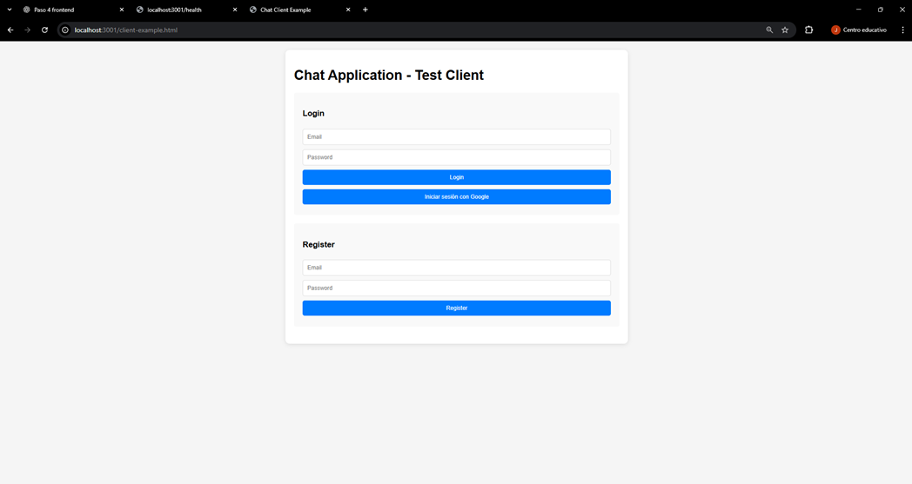
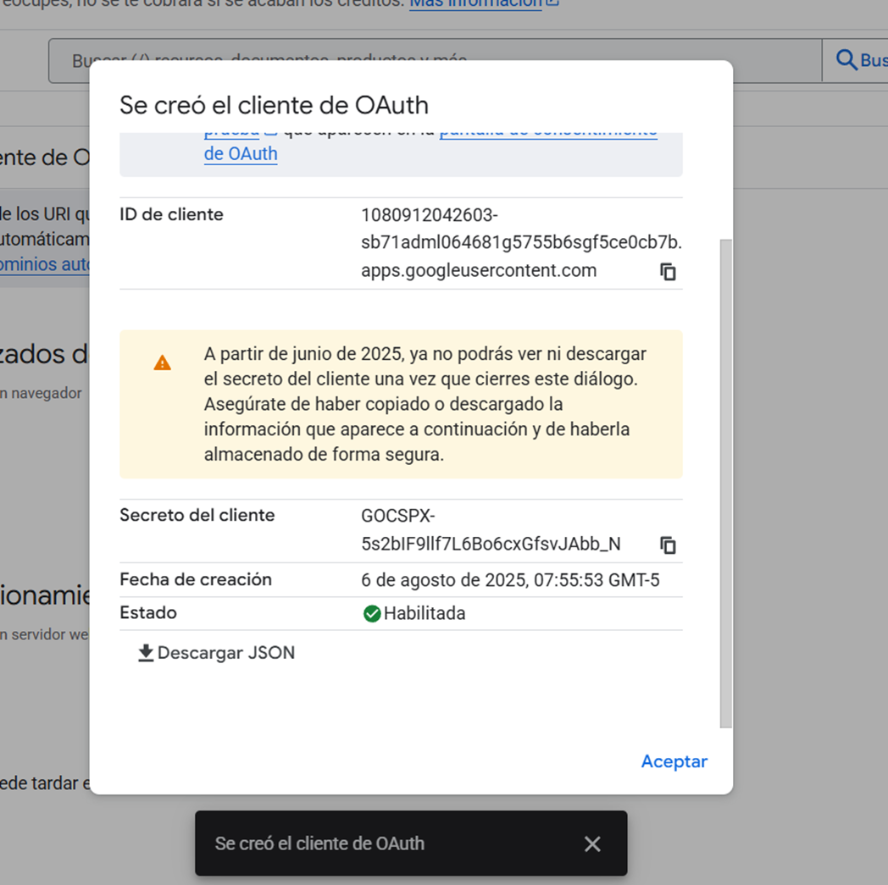
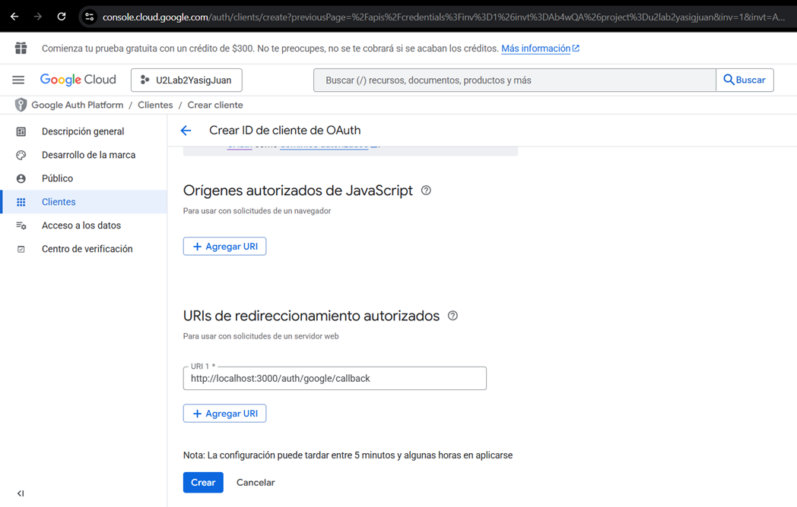
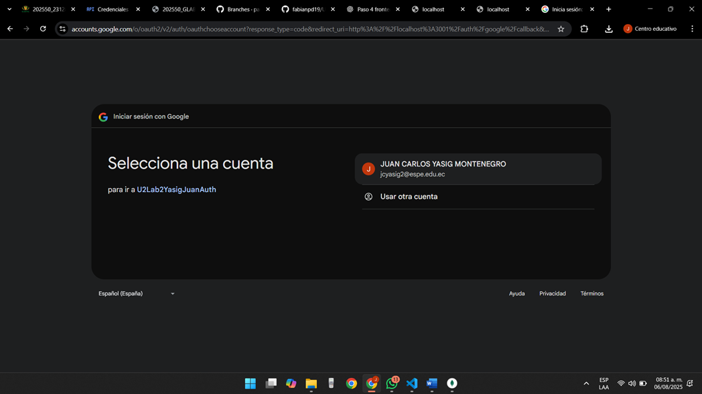
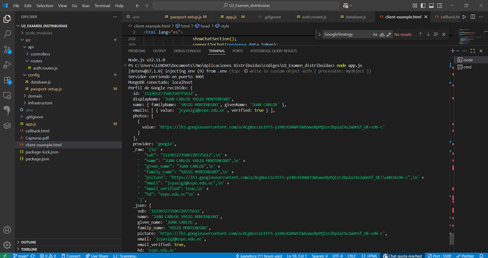
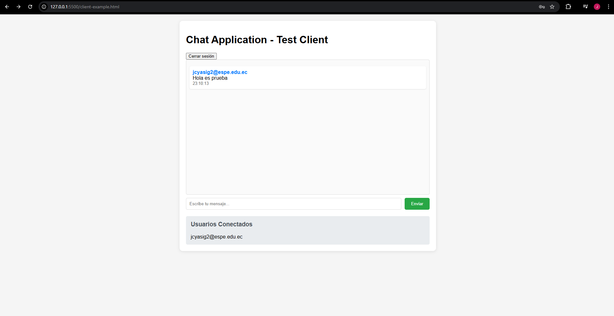

# 💻 Laboratorio U3 – Chat con Autenticación OAuth2 y Socket.IO
**Autor:** Juan Carlos Yasig Montenegro  
**Materia:** Aplicaciones Distribuidas  
**Docente:** Ing. Paulo Galarza
**Fecha:** 06 Agosto 2025  

---

## 📘 Introducción

El presente laboratorio tiene como objetivo implementar una aplicación de chat en tiempo real utilizando tecnologías modernas como Node.js, WebSockets (Socket.IO), y autenticación OAuth2 con Google. El propósito principal es comprender la integración de múltiples servicios en una sola aplicación distribuida, con énfasis en seguridad y experiencia de usuario.

---

## 🎯 Objetivos

### 🎯 Objetivo General

Desarrollar una aplicación de mensajería en tiempo real con autenticación segura mediante OAuth2 (Google) utilizando Node.js, Express, Socket.IO y MongoDB.

### ✅ Objetivos Específicos

- Integrar autenticación con Google usando Passport.js.
- Implementar chat en tiempo real mediante WebSockets.
- Validar usuarios mediante JSON Web Tokens (JWT).
- Mantener persistencia de usuarios y mensajes usando MongoDB.

---

## 📚 Marco Teórico

- **OAuth2:** Protocolo de autorización que permite el acceso seguro a recursos del usuario mediante un token.
- **JWT (JSON Web Token):** Método de autenticación basado en tokens firmado digitalmente.
- **Socket.IO:** Biblioteca que permite la comunicación en tiempo real entre el cliente y el servidor.
- **Passport.js:** Middleware de autenticación para Node.js.
- **MongoDB:** Base de datos NoSQL para almacenar usuarios y mensajes.

---

## ⚙️ Desarrollo

1. **Configuración del backend:**  
   Uso de Express, Passport.js, JWT, y controladores para autenticación y chat.

2. **Flujo de autenticación con Google:**  
   Implementación de la ruta `/auth/google`, generación de tokens JWT, y redirección al cliente.

3. **Frontend con HTML/JS puro:**  
   Archivo `client-example.html` permite el acceso vía correo/contraseña o Google.

4. **Conexión de Socket.IO:**  
   Solo se permite conexión si el JWT es válido. Los usuarios autenticados pueden enviar y recibir mensajes en tiempo real.

5. **Gestión de usuarios conectados:**  
   Se muestra la lista de usuarios activos en tiempo real y quién está escribiendo.

---

## 📝 Descripción del Procedimiento

- Se instaló el entorno Node.js y MongoDB local.
- Se creó la aplicación Express y se configuró Passport con la estrategia Google OAuth2.
- Se implementaron rutas de autenticación, emisión de JWT y sockets protegidos.
- Se creó un frontend estático con formularios de login/registro y chat.
- Se habilitó conexión WebSocket con envío de mensajes autenticados.
- Se almacenó información en MongoDB para usuarios y mensajes.
- Se incluyó validación de formularios con Joi.

---

## 📊 Análisis de Resultados

- ✅ La autenticación mediante Google funciona correctamente.
- ✅ El token JWT es emitido y validado para cada sesión activa.
- ✅ El sistema de mensajería funciona en tiempo real para múltiples usuarios.
- ✅ Se manejan eventos como usuarios escribiendo y conexión/desconexión.
- ✅ El sistema mantiene seguridad básica al evitar accesos no autenticados.

---

## 📷 Gráficos y Evidencias

###  Login general

###  Creacion de cliente en Google Cloud

###  Configuracion redireccionamiento autorizado del cliente

###  Login con Google exitoso 1

###  Login con Google exitoso 2

###  Login con Google exitoso 3

###  Funcionamiento del chat

---

## 💬 Discusión

Durante el desarrollo se presentaron retos técnicos como:

- La correcta redirección tras el callback de Google a una ruta personalizada.
- Manejo del token JWT en el cliente y su persistencia en el almacenamiento local.
- Restricción de acceso a sockets para usuarios no autenticados.
- Sincronización de múltiples eventos en tiempo real entre varios usuarios.
- Manejadores de errores en Express y fallback para rutas no definidas.

Estas dificultades fueron superadas mediante debugging en consola, documentación oficial y pruebas iterativas.

---

## ✅ Conclusiones

- La integración entre autenticación con Google, JWT y Socket.IO permite una aplicación distribuida moderna, funcional y segura.
- La implementación en Node.js permite modularizar componentes y escalar fácilmente.
- Se adquirió experiencia en OAuth2, validación, tokens, MongoDB y WebSockets.
- El sistema es extensible a otras formas de autenticación o funcionalidades de chat.

---

## 📚 Bibliografía

- [Passport.js – Google Strategy](http://www.passportjs.org/packages/passport-google-oauth20/)
- [Socket.IO Documentation](https://socket.io/docs/v4/)
- [JWT Introduction](https://jwt.io/introduction)
- [MongoDB Documentation](https://www.mongodb.com/docs/manual/)
- [OAuth2 Explained](https://www.digitalocean.com/community/tutorials/oauth-2-how-it-works)

